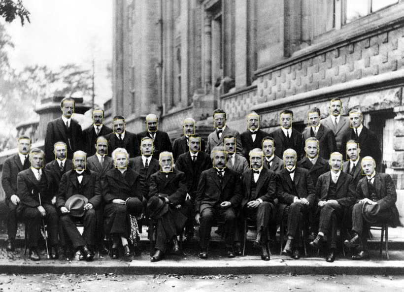

<h1 align="center">multi-stream-face-recognition</h1>

<p align="center">
  <i>Reference C++ pipeline for multi-camera face recognition on NVIDIA DeepStream + TensorRT, with FAISS GPU vector search.</i>
</p>

<p align="center">
  <a href="https://github.com/Abdirayimov/multi-stream-face-recognition/actions/workflows/ci.yml"></a>
  
  
  
  
  
  
</p>

---

## Demo

<p align="center">
  
</p>

The actual output of the C++ `face_detect` tool: SCRFD (TensorRT FP16)
run on the public-domain 1927 Solvay Conference photograph. It finds
all **29 attendees** — every face boxed, each with its five landmarks
(eyes, nose, mouth corners) drawn — at a 640×640 detector input even
though the faces are small in a 3000-px group shot.

The detector resolves its output tensors by *shape* rather than by
name, so it works directly with insightface's stock `buffalo_l`
`det_10g` export (numeric output names) as well as hand-named exports.

```bash
# model prep: the SCRFD ONNX from the insightface buffalo_l pack
./scripts/download_models.sh
./scripts/build_engines.sh                 # ONNX -> FP16 engine
./build/face_detect --config configs/demo_faces.yaml \
    --input group.jpg --output annotated.jpg
```

> Built inside the project's Docker image (`docker/Dockerfile`, which is
> based on the DeepStream devel image) and run on an RTX 4080. The tool
> itself needs neither FAISS nor DeepStream at runtime — it is a
> detection-only build.

---

## Why this exists

Multi-camera face recognition is no longer a model problem. Modern detectors
(SCRFD, YOLOFace, RetinaFace) and embedders (ArcFace and friends) have been
solved for years. The hard, unglamorous engineering lives between the model
and the wire:

- **Pipeline plumbing.** Keeping a GStreamer / DeepStream pipeline alive
  while sources connect, disconnect, and stall under load. Backpressure,
  graceful source removal, batched-push timing, EOS handling.
- **Batched, asynchronous inference.** Detection runs per frame, but the
  encoder wants its aligned crops in one TensorRT call to amortise the
  context switch. That requires a probe that collects every detection in a
  frame, aligns them, and pushes a single batch to the encoder — rather
  than one call per face.
- **Vector search at scale.** FAISS IVF-Flat is excellent up to roughly 100K
  enrolled identities; beyond that you need IVF-PQ or sharding, and the cost
  of getting `nlist`, `nprobe`, and the metric wrong shows up as silent
  recall regressions. The index has to live on the GPU but be persisted from
  CPU.
- **Decision logic.** Top-1 similarity alone is a recipe for false positives
  in dense enrollments. A margin against top-2 catches most of them; a
  per-track confirmation layer catches the rest.

This repository is a clean-room reference implementation of those patterns.
It is not a fork of any production system; the code is original and
intentionally focused on showcasing structure and engineering decisions
rather than every feature you would ship.

## What's inside

- C++17 + CMake build targeting DeepStream 7.x / 8.x and TensorRT 8.6+
- SCRFD detector wrapper (three-stride decoder, NMS, letterboxed input)
- ArcFace ResNet50 embedder with batched TensorRT inference
- 5-point face aligner using a Umeyama similarity transform
- FAISS GPU index with adaptive IVF-Flat / IVF-PQ selection
- Probe chain that aligns every face in a frame and encodes them in one
  batched call, then applies the top-1/top-2 margin rule — unit-tested
  end-to-end against stubbed backends
- Multi-source DeepStream pipeline with thread-safe `add_source` / `remove_source`
- Three CLI tools: `face_detect` (annotate a still, used for the demo
  above), `face_enroll` (build an index from a public dataset) and
  `face_benchmark` (FAISS latency / throughput), plus the `face_server`
  pipeline binary
- Docker + docker-compose for reproducible runs
- Structured JSON logging (`spdlog`)
- GoogleTest suite (101 tests) over the algorithmic stages — Umeyama
  transform, SCRFD decode, NMS, letterboxing, config validation, the
  match decision, and the recognition chain itself — building without
  CUDA or TensorRT

## Architecture

```
                ┌──────────┐    ┌──────────┐    ┌────────────┐    ┌─────────┐
RTSP / file ──► │ uridecode│ ──►│nvstream  │ ──►│   nvinfer  │ ──►│ appsink │
                │   bin    │    │  mux     │    │   (SCRFD)  │    │         │
                └──────────┘    └──────────┘    └─────┬──────┘    └─────────┘
                                                      │
                                       src-pad probe (parses tensor meta)
                                                      ▼
                ┌────────────────────────────────────────────────────┐
                │                  ProbeChain                        │
                │  ┌──────────┐   ┌──────────┐   ┌────────────────┐  │
                │  │  align   │──►│  encode  │──►│ FAISS search + │  │
                │  │ (5-point)│   │ (ArcFace)│   │ margin filter  │  │
                │  └──────────┘   └──────────┘   └────────────────┘  │
                └────────────────────────────────────────────────────┘
                                          │
                                          ▼
                                  FrameResult callback
                                  (logging / Redis / DB)
```

Everything from the src-pad probe downwards is the design, not the
current state: the probe is **not attached**, so on a live stream the
pipeline stops after `nvinfer`. `ProbeChain` and its three stages are
implemented and tested end-to-end, just not yet driven by GStreamer.
See [Limitations](#limitations).

## Performance

Indicative numbers on synthetic 720p streams, RTX 3060 (12 GB),
batch_size=8. Real numbers depend heavily on input resolution, face
count per frame, and chosen index parameters; treat these as a sanity
floor, not a benchmark.

| Stage                          | p50 latency | Throughput        |
|--------------------------------|------------:|-------------------|
| SCRFD detection (per frame)    |       ~7 ms | ~140 FPS @ batch 8 |
| ArcFace encoding (per face)    |       ~2 ms | ~500 faces/s @ batch 32 |
| FAISS search, n=10K, top-5     |     ~0.3 ms | ~3K queries/s     |
| FAISS search, n=50K, top-5     |     ~0.9 ms | ~1K queries/s     |

`tools/face_benchmark` regenerates the FAISS numbers locally; the rest
require trained engines built from the public InsightFace ONNX
checkpoints (see `scripts/download_models.sh`).

## Quick start

```bash
# 1. Build
cmake -S . -B build -G Ninja \
      -DCMAKE_BUILD_TYPE=Release
cmake --build build -j

# 2. Get the public ONNX checkpoints (insightface buffalo_l)
./scripts/download_models.sh

# 3. Compile TensorRT engines
./scripts/build_engines.sh

# 4. (Optional) generate four synthetic test streams
./scripts/generate_test_streams.sh 4

# 5. Run
./build/face_server --config configs/system_config.yaml \
                    --pgie configs/pgie_scrfd.txt
```

Or, with Docker:

```bash
docker compose up --build
```

## Project structure

```
.
├── CMakeLists.txt
├── cmake/                    # Find* modules + compiler settings
├── configs/                  # YAML system config + pgie_scrfd.txt
├── docker/                   # Dockerfile + entrypoint
├── docker-compose.yml
├── include/face_pipeline/    # Public headers
│   ├── align/                # Face aligner
│   ├── config/               # System config types
│   ├── indexing/             # FAISS searcher
│   ├── pipeline/             # DeepStream pipeline + probe chain
│   ├── trt/                  # TRT engine, SCRFD, ArcFace
│   └── utils/                # Logger, CUDA helpers
├── src/                      # Implementation files (mirrors include/)
├── tools/                    # face_enroll.cpp, benchmark.cpp
├── scripts/                  # download_models.sh, build_engines.sh, ...
└── docs/
```

## Building from source

You will need:

- CMake 3.22+
- A C++17 compiler (GCC 11+ recommended)
- CUDA Toolkit 12.x
- TensorRT 8.6+ (matching your CUDA version)
- DeepStream SDK 7.x or 8.x
- OpenCV 4.5+ with CUDA modules (`cudaimgproc`, `cudawarping`)
- Eigen 3.4+
- spdlog, yaml-cpp, FAISS (GPU build)
- gstreamer-1.0 development headers

The Docker build (`docker/Dockerfile`) uses the official NVIDIA DeepStream
devel image as the toolchain and is the most portable way to build.

### Tests

The algorithmic stages sit in a `face_pipeline_core` target that links
only OpenCV, Eigen and yaml-cpp, so the test suite builds on a machine
with no NVIDIA stack at all:

```bash
cmake -S . -B build-tests -G Ninja \
      -DFACE_PIPELINE_CPU_ONLY=ON \
      -DFACE_PIPELINE_BUILD_TESTS=ON
cmake --build build-tests -j
ctest --test-dir build-tests --output-on-failure
```

86 tests cover the Umeyama similarity transform, letterboxing and its
coordinate round-trip, SCRFD anchor counts and distance decoding, IoU
and NMS, config parsing plus validation, and the recognition margin
rule. GoogleTest is fetched at configure time (pinned to `v1.14.0`).

The GPU stages — TensorRT engine wrapper, ArcFace encoder, FAISS
searcher, DeepStream pipeline — are not unit tested; they need a device
and a serialized engine. See [docs/building.md](docs/building.md).

### CI

CI runs clang-format, cppcheck, and the CPU-only unit tests (Umeyama
transform, SCRFD decode, NMS, letterbox, config). **The full CUDA /
TensorRT / DeepStream build is not exercised on GitHub runners** — they
carry none of those SDKs. Build it locally or through the provided
Docker image.

## Configuration

`configs/system_config.yaml` is the single source of truth for runtime
parameters. The most important sections:

- `pipeline.batch_size` — must match the engine's max batch and the
  `batch-size` field in `pgie_scrfd.txt`.
- `detection.confidence_threshold`, `detection.nms_iou_threshold` — affect
  recall and clutter; calibrate against your input distribution.
- `faiss.index_type` — `ivf_flat` or `ivf_pq`. `ivf_pq` is automatically
  chosen above `faiss.ivf_pq_min_size` enrollments.
- `recognition.threshold`, `recognition.margin_min` — the gate for
  reporting a positive match. Margin is more important than absolute
  threshold for dense enrollments.

## Limitations

- **The DeepStream path does not run the recognition chain.** No src-pad
  probe is attached to `nvinfer`, so `face_server` builds the pipeline and
  runs SCRFD, but the detections are never handed to `ProbeChain` — align,
  encode, search and the margin rule are not invoked on a live stream. The
  chain is complete and unit-tested end-to-end against stubbed encoder and
  index backends (`tests/test_probe_chain.cpp`); attaching it to a live pad
  is the remaining integration step and is on the roadmap.
- Only the face track is implemented. Real deployments often need a
  second pass over body crops (re-ID) or multi-mode tracking; both are
  out of scope for this reference.
- No persistent enrollment storage. `face_enroll` writes a FAISS index
  file directly; pgvector / RDBMS integration is left as an exercise.
- No gRPC or REST surface in this reference. The `DeepStreamPipeline`
  exposes `add_source` / `remove_source` programmatically and is meant
  to be wrapped by whichever transport you prefer.
- Engines must be FP16/FP32; INT8 calibration scaffolding is sketched in
  `scripts/build_engines.sh` but not validated end-to-end.

## Roadmap

- [ ] Attach the src-pad probe so the recognition chain runs on a live
      DeepStream stream, not only under test
- [ ] gRPC façade for camera management and identity enrollment
- [ ] PostgreSQL + pgvector store as a fallback / persistence layer
- [ ] NvDCF tracker integration with per-track recognition fusion
- [ ] INT8 calibration recipe with a reproducible calibration set

## License

MIT — see [LICENSE](LICENSE).

## About

This repository is a reference implementation of techniques and patterns
I have used in production face-recognition systems. It uses public
algorithms (SCRFD, ArcFace, FAISS) and synthetic / public datasets only;
no proprietary code, configurations, or data are included.

Open to contract work on similar systems —
[email](mailto:khusanabdirayimov@gmail.com) ·
[GitHub](https://github.com/Abdirayimov)
