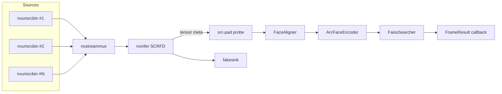

# Architecture

This document expands on the diagram in `README.md` and describes how the
pieces fit together at runtime.

## Pipeline graph



## Threading model

- The GStreamer main loop runs on a dedicated thread inside
  `DeepStreamPipeline`. All pad / element manipulation goes through this
  thread (or the GLib main context).
- The src-pad probe is invoked on a streaming thread owned by
  `nvinfer`. From there, alignment and encoding happen synchronously on
  the same thread, so heavy work in the probe will throttle the upstream
  pipeline. Move that work behind a queue if you need to scale beyond
  ~8 streams.
- `add_source` / `remove_source` are safe to call from any thread; they
  hold an internal mutex while creating bins and requesting muxer pads.

## Why a single nvinfer per pipeline

Each `nvinfer` instance carries its own TensorRT context and CUDA
streams. Running one detector globally and batching across sources is
substantially cheaper than spawning per-source detectors, even at low
camera counts. The downside is that your detector engine's max batch
must match `pipeline.batch_size`; engines with mismatched batches will
fail to load.

## Probe chain ordering

```
detections ──► align ──► encode_batch ──► search per face ──► margin filter
```

- **Align before encoding.** ArcFace is sensitive to in-plane rotation
  and scale; the canonical 112x112 reference points eliminate both.
- **Batch encoding is mandatory.** A naive per-face TRT call costs
  ~2-3x its batched equivalent because of the per-call overhead. With
  realistic crowds (5-10 faces per frame, 4-8 streams), batches of 32-64
  are easy to build.
- **Margin > absolute similarity.** When the index has 50K+ identities,
  the cosine landscape is dense enough that two near-twins both clear
  any reasonable absolute threshold; the gap to top-2 is a far better
  separator. The defaults (`threshold=0.45`, `margin_min=0.04`) are a
  reasonable starting point but should be tuned with a held-out set.

## Index lifecycle

- Built once via `face_enroll` from a labeled image directory.
- Loaded into `FaissSearcher` on `face_server` startup.
- Live add/remove flows through `FaissSearcher::add` / `remove`, which
  re-syncs to the GPU after every mutation. For high-frequency mutations
  consider batching adds and only re-uploading periodically.
- Persisted via `FaissSearcher::save`. FAISS GPU indexes are not
  directly serializable, so save/load round-trips through a CPU copy.

## Failure modes worth thinking about

- **Source disconnect.** `nvurisrcbin` will emit EOS or ERROR on the
  bus. The current implementation logs and continues; production code
  should re-create the bin after a backoff.
- **Encoder OOM.** Batch sizes higher than your engine's max profile
  shape will throw at `set_input_shape`. Catch and downsize.
- **Index drift.** If `face_enroll` is re-run while `face_server` holds
  an open index, the in-memory copy will diverge from disk. Use file
  locks or signal the server to reload.
